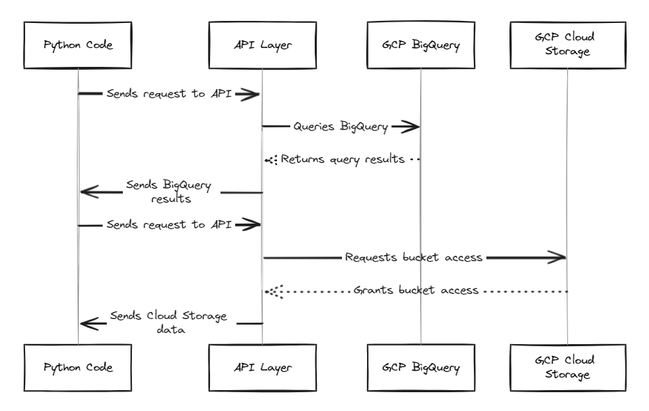

## GCP Helper Scripts: BigQuery and Cloud Storage

This directory contains two reusable Python functions for interacting with Google Cloud Platform (GCP) services:

* **bigquery.py:** This script provides a function `run_bigquery_query` that establishes a BigQuery client, executes a user-defined query on a specific dataset and table, and returns the query results.
* **storage.py:** This script offers a function `upload_file_to_storage` that uploads a local file to a Cloud Storage bucket.

**Important Notes:**

* **Authentication:** Both scripts rely on environment variables for authentication. You'll need to set the `GOOGLE_APPLICATION_CREDENTIALS` environment variable to point to your service account JSON key file before running these scripts.
* **Placeholder Values:** The scripts currently include placeholder values for project ID, dataset ID, table ID, bucket name, and local file path. Replace these with your specific values before running the functions. 

**Using the Functions:**

1. **Set Up Authentication Creating New Credential:**

```bash
gcloud auth application-default set-quota-project training-gcp-309207
```

2. **Replace Placeholders:**

Modify the scripts (`bigquery.py` and `storage.py`) to use your project IDs, dataset/table IDs, bucket name, and local file path.

3. **Run the Scripts:**

Execute the scripts from your terminal using:

```bash
python bigquery.py  # Run BigQuery query
python storage.py  # Upload file to Cloud Storage
```

**Function Details:**

### bigquery.py

This script defines `run_bigquery_query` to connect to BigQuery, execute a query, and retrieve results:

```python
def run_bigquery_query(project_id, dataset_id, table_id):
  """Executes a BigQuery query and returns the results."""
  # ... (function code)
```

**Key points:**

* It takes project ID, dataset ID, and table ID as arguments.
* Optionally configures basic logging.
* Creates a BigQuery client and executes the specified query.
* Returns the query results as a list of rows.

### storage.py

This script defines `upload_file_to_storage` to upload a file to Cloud Storage:

```python
def upload_file_to_storage(local_file_path, bucket_name, blob_name):
  """Uploads a local file to a Cloud Storage bucket."""
  # ... (function code)
```

**Key points:**

* It takes local file path, bucket name, and desired blob name as arguments.
* Optionally retrieves credentials from the environment variable.
* Creates a Cloud Storage client and uploads the file.
* Prints a confirmation message upon successful upload.

**Additional Notes:**

* These scripts are designed to be modular and reusable. 
* Consider error handling and more advanced logging for production use.

### Sequence diagram
